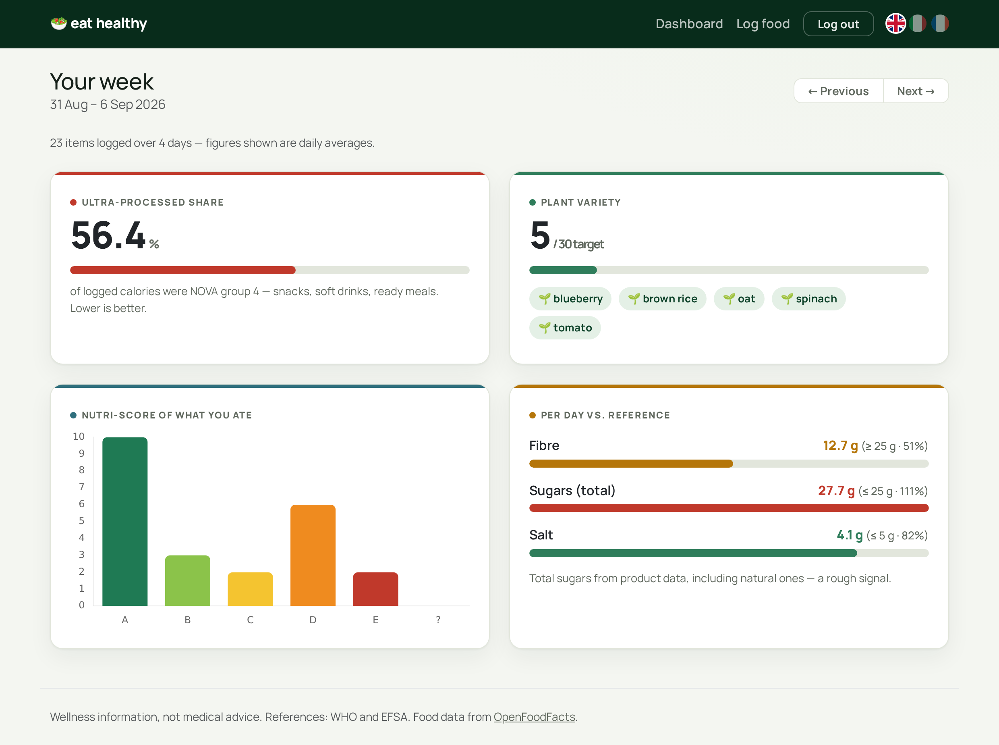
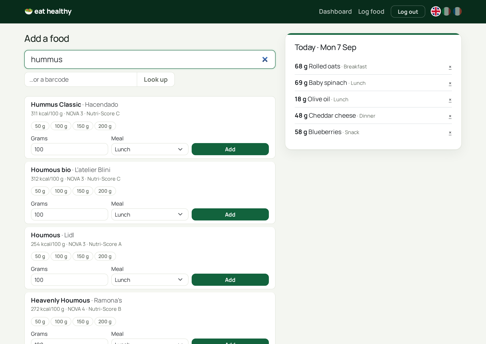

# eat healthy

[](https://github.com/pamm-bot/eat-healthy/actions/workflows/ci.yml)

**English** · [Français](README.fr.md)

Log what you eat and get a plain weekly picture of *how* you ate — not calorie
targets. How much of the week was ultra-processed, how varied your plants were,
and how your fibre, sugar and salt compare to public-health references.

**Live demo:** https://eat-healthy-pam-a5a77d152949.herokuapp.com/ — log in as
`demo` / `demo12345` for a pre-populated fortnight.

## Screenshots

| Weekly dashboard | Logging a food |
|---|---|
| [](docs/screenshots/dashboard.png) | [](docs/screenshots/log.png) |

## What it does

1. **Log a food** — search by name or enter a barcode. Products, plus their
   NOVA processing group and Nutri-Score, come from
   [OpenFoodFacts](https://world.openfoodfacts.org/).
2. **Add your portion** — grams and which meal. A few seconds per item.
3. **Read your week** — a dashboard that turns the log into:
   - **ultra-processed share** — % of your logged calories from NOVA group 4
   - **plant variety** — how many different whole plant foods you ate, against
     a 30-a-week target
   - **Nutri-Score** distribution of what you ate
   - **fibre / sugars / salt** per day vs. WHO / EFSA references

It is descriptive on purpose — no calorie goals, no weight, no "eat less".

## Stack

- Django 6.1, PostgreSQL — server-rendered templates, **htmx** for the search
  and log without full page reloads
- Django's built-in session authentication
- Bootstrap 5, Chart.js (for the Nutri-Score chart)
- WhiteNoise, gunicorn, deployed on Heroku
- pytest, black, flake8, bandit; CI on GitHub Actions

## Design decisions

- **Server-rendered, not an API.** My other Django project is a DRF API with a
  separate JS client; this one is the other common shape — Django templates with
  htmx for the interactive bits. Less moving parts for an app that's mostly
  forms and a dashboard.
- **The weekly report is pure logic.** Turning a pile of logged portions into
  "how processed, how varied, how much fibre / sugar / salt" is the one real
  piece of domain logic, so it lives in
  [`tracker/reports.py`](tracker/reports.py) as plain functions with no queries
  or writes, unit-tested on synthetic entries.
- **OpenFoodFacts data is cached locally.** The API is messy and rate-limited,
  so the first time a product is logged it's normalised into a `Food` row and
  reused after that — the client
  ([`tracker/openfoodfacts.py`](tracker/openfoodfacts.py)) returns plain dicts,
  never model instances, and every call has a timeout and swallows request
  errors instead of 500-ing a view.
- **Averages are over the days you logged**, not the calendar week, and the
  dashboard says so — a blank day shouldn't drag your daily fibre to zero.
- **Honest about the data.** OpenFoodFacts gives *total* sugars, not added
  sugars, and its category tags are uneven, so the "plant variety" match is
  best-effort. The UI labels both rather than pretending to precision.
- **Not medical advice.** Reference values are cited (WHO, EFSA) and the framing
  stays on *description*, which also keeps it away from disordered-eating
  territory.

## Setup

```bash
python3 -m venv venv
source venv/bin/activate
pip install -r requirements-dev.txt
cp .env.example .env   # then set SECRET_KEY, DATABASE_URL
python manage.py migrate
python manage.py seed_demo   # optional: the demo account + two weeks of entries
python manage.py runserver
```

`seed_demo` creates `demo` / `demo12345` with a fortnight of hard-coded entries
(no network needed), so the dashboard has something to show. Safe to re-run.

## Tests

```bash
pytest
```

Runs on every push and pull request via GitHub Actions, alongside `black
--check`, `flake8` and `bandit`. The tests cover the models, the OpenFoodFacts
client (against canned JSON), the views, and the weekly report in detail.

## Roadmap

- **Phase 2 — meal planner.** Given the days you cook, your dietary rules and a
  time budget, generate a balanced week of meals plus a consolidated shopping
  list — a constraint-satisfaction problem over the same data this phase
  collects.
- Camera barcode scanning (currently a barcode field).
- A weekly email summary.
